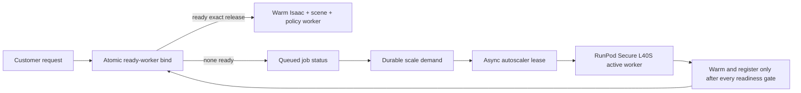

# Production GPU startup and warm-pool runbook

This is the customer-serving architecture for the GR00T + OSCAR + Isaac lane.
The older “allocate a generic Ubuntu VM, install the host runtime, pull the
worker image, then warm everything” flow remains useful release-engineering
evidence. It is not an accepted production request path.

After warm-worker binding, `production_gpu_campaign_control_plane.py` is the
sole durable authority for smoke gating, episode transitions, resumable
artifacts, terminal conditions, and customer-visible status. See
`docs/PRODUCTION_GPU_RELIABILITY_OPERATING_MODEL.md` for the complete golden
path and ownership model.

## Launch targets and hard boundaries

| Phase | Target | Customer request may perform it? |
|---|---:|---|
| Bind an already-ready worker | p95 <= 10 seconds (hard contract <= 30 seconds) | Yes |
| Start the already-warm task session | seconds to a few minutes | Yes |
| Replenish one cached active worker | release target <= 1,800 seconds | No; asynchronous autoscaler only |
| Install driver, Docker, NVIDIA runtime, Python, Isaac, or models | Never at runtime | No |
| Pull the 47 GB worker image during VM boot | Never | No |

The release unit is the exact tuple:

1. immutable provider host image ID;
2. worker image in `repository@sha256:<64 lowercase hex>` form;
3. GPU serving class.

The RunPod serving class is
`runpod-secure-l40s-preferred-a40-fallback`; the host evidence separately
records the actual `NVIDIA L40S` or `NVIDIA A40` model. This prevents an A40
fallback from masquerading as an L40S while allowing both to satisfy the same
explicitly authorized customer capability class.

`production_gpu_worker_pool.release_fingerprint` binds those values. A worker
from another tuple cannot satisfy the request.

## Architecture



For the current `active_worker_only` image, launch with at least two ready
workers so one lease or replacement does not expose cold provisioning to the
next customer. The customer bind transaction performs zero provider calls. The autoscaler is
the only component that may consume a scale request and call RunPod. Scale
requests have atomic expiring claims so two reconcilers cannot provision the
same deficit.

## 1. Classify and preload the immutable release

The current exact release is
`docker.io/nijelhunt/blueprint-groot-oscar-eval@sha256:ab8fbccb714242b55811aa5142933001dfba76d56b5cc29dead4d0bdf1346e88`.
Its measured compressed size is 47,101,357,226 bytes and its largest layer is
14,083,497,680 bytes. The serving contract classifies it as
`active_worker_only`, not scale-to-zero eligible. Customer traffic therefore
requires a continuously active, fully warmed worker. A stopped or newly
allocated Pod is replenishment capacity, never a synchronous customer path.

```bash
python -m blueprint_pipeline.production_gpu_image_contract \
  --diagnostic <registry-manifest-diagnostic.json> \
  --expected-image-ref <repository>@sha256:<digest> \
  --out production_gpu_image_serving_contract.json
```

A future scale-to-zero candidate must stay below the configured total/layer
budgets and externalize models behind an immutable model manifest. Passing
those static budgets still does not prove a live startup SLO.

### Optional provider-owned host image

The source image must already contain the selected provider/GPU driver payload.
The Packer build adds Docker, NVIDIA Container Toolkit, and the exact cached
worker image. It records `/etc/blueprint/worker-image-ref` and a non-secret host
manifest. It uses no mutable worker tag.

The Packer runner must reach the private subnet and registry through existing
operator-owned infrastructure. Registry access comes from the short-lived
builder identity or its credential helper; no registry secret is accepted by
the bake script or captured in the image.

```bash
packer init deploy/packer/gcp_g4_gpu_worker_host.pkr.hcl
packer build \
  -var 'project_id=<project>' \
  -var 'zone=<zone>' \
  -var 'image_storage_location=<region-or-multi-region>' \
  -var 'source_image=projects/<project>/global/images/<verified-driver-source>' \
  -var 'image_name=blueprint-g4-host-<release-id>' \
  -var 'worker_image_ref=<registry>/<worker>@sha256:<digest>' \
  -var 'network=<network>' \
  -var 'subnetwork=projects/<project>/regions/<region>/subnetworks/<subnet>' \
  -var 'service_account_email=<builder-service-account>' \
  deploy/packer/gcp_g4_gpu_worker_host.pkr.hcl
```

Packer build completion proves only that the host disk was assembled and the
OCI digest is cached. It does not prove the target GPU, renderer, policy, scene,
warm-pool capacity, latency, or teardown.

## 2. Canary the exact release tuple

Launch one bounded canary from the new host image. The boot script in
`cloud_vm_render_providers.py` must:

- match `/etc/blueprint/worker-image-ref` to the requested digest;
- pass `docker image inspect` without registry login or `docker pull`;
- start the exact digest with GPU access;
- fail closed before the customer scene if host/runtime preflight fails.

Collect the host image ID, worker digest, GPU family, provider machine identity,
driver/runtime checks, image healthcheck, Isaac renderer warmup, kitchen scene
load, policy endpoint load, timestamps, spend, and API-confirmed teardown.
Do not promote from Packer output alone.

## 3. Start the private pool control plane

Install the package and the supplied systemd unit. Create a random token of at
least 32 bytes in the configured file, owned by `blueprint`, mode `0600`. Put
the loopback service behind private IAM/service-mesh authentication; the CLI
refuses a public bind.

```bash
sudo install -m 0644 deploy/systemd/blueprint-production-gpu-worker-pool.service /etc/systemd/system/
sudo install -d -o blueprint -g blueprint -m 0750 /var/lib/blueprint /etc/blueprint/secrets
sudo install -o blueprint -g blueprint -m 0600 <token-file> /etc/blueprint/secrets/production_gpu_pool_token
sudo install -m 0640 deploy/systemd/production-gpu-worker-pool.env.example /etc/blueprint/production-gpu-worker-pool.env
sudo systemctl daemon-reload
sudo systemctl enable --now blueprint-production-gpu-worker-pool
curl --fail http://127.0.0.1:8790/healthz
```

## 4. Maintain minimum ready capacity asynchronously

Call `reconcile_min_ready` on a timer for the promoted release tuple. It writes
durable scale demand and performs no provider mutation. An autoscaler claims a
request through `/v1/autoscaler/scale-requests/claim`; only that lease owner may
launch the requested deficit. `production_gpu_runpod_autoscaler.py` enforces:

- no claim or provider call without explicit paid authorization;
- the unchanged USD 20 and 10,980-second combined caps;
- exactly one Secure Cloud L40S first attempt;
- exactly one A40 fallback only after an authoritative RunPod create response
  proves capacity rejection with no allocation;
- no fallback and no claim release after an ambiguous allocation outcome.

The autoscaler must use Standard/reserved/on-demand capacity for the customer
minimum. Spot/Flex/marketplace capacity may be a burst tier but cannot be the
only ready pool. Provider capacity allocation still happens asynchronously and
is not part of the customer latency SLO.

## 5. Register only genuinely ready workers

Launch the Isaac runner with `--serve-production-warmup-before-ready`. It runs
one supplied warmup scenario before publishing production readiness and only
sets renderer/policy health true when it observes newly rendered PNGs and a
fresh GR00T command-call artifact. The marker is bound to the launch-session ID
and exact image digest.

Then run `python -m blueprint_pipeline.production_gpu_worker_agent`. It accepts no customer
command. It joins host-boot evidence, exact image/model-cache evidence, and the
same-session `production_gpu_warm_serve_ready.v2` marker. It registers only
after all nine checks pass and heartbeats with a mode-0600 token file.

Registration requires every boolean below to be true:

- `host_image_booted`
- `nvidia_driver_ready`
- `container_runtime_ready`
- `worker_image_cached`
- `models_cached_offline`
- `isaac_renderer_warm`
- `kitchen_scene_loaded`
- `policy_endpoint_ready`
- `worker_healthcheck_passed`

Missing or false checks reject registration. Ready workers heartbeat at an
interval comfortably below the 45-second default TTL. Stale ready workers and
expired customer leases become quarantined, not reusable. A completed job
returns a worker to `ready` only when the worker reports healthy with the exact
active lease token; otherwise it is quarantined.

The bounded production rehearsal performs that join automatically. Before any
RunPod create it atomically reserves both the USD and combined-GPU-second caps,
arms the independent watchdog, and requires the secure pool and credential-free
HTTPS worker broker route:

```bash
python scripts/run_warm_render_worker.py start \
  --production --allow-paid --provider runpod \
  --out-dir <worker-evidence-dir> \
  --image 'docker.io/nijelhunt/blueprint-groot-oscar-eval@sha256:ab8fbccb714242b55811aa5142933001dfba76d56b5cc29dead4d0bdf1346e88' \
  --worker-image-manifest-diagnostic <registry-manifest-diagnostic.json> \
  --warmup-scenarios-json <warmup-scenarios.json> \
  --hard-ttl-seconds <bounded-attempt-seconds> \
  --campaign-budget-ledger <durable-campaign-budget.json> \
  --campaign-initial-spent-usd <reconciled-baseline> \
  --campaign-initial-used-gpu-seconds <reconciled-baseline> \
  --pool-base-url https://<private-pool-endpoint> \
  --pool-token-file <mode-0600-token-file> \
  --worker-endpoint-ref 'https://<private-broker>/workers/{worker_id}'
```

`{worker_id}` is replaced only after RunPod returns the allocated pod ID, so
the command remains one-shot without placing a provider ID or credential in
the customer-facing request path.

The baseline arguments are accepted only when creating the ledger. Subsequent
processes must reuse its immutable identity. Open reservations retain their
full worst-case charge; only provider-confirmed no-allocation or proven
teardown may settle them. A worker is quarantined in the pool before provider
termination so a dead endpoint cannot be selected during teardown.

## 6. Bind the customer job

`POST /v1/customer-jobs/bind` carries the job ID and exact release tuple. The
only synchronous outcomes are:

- `bound_to_ready_worker`, with an opaque private endpoint and lease token; or
- `queued_waiting_for_warm_worker`, with a durable scale-request ID.

Both report `customer_request_provider_calls: 0` and
`cold_provisioning_started_in_request_path: false`. The WebApp should return the
job ID/status and continue asynchronously; it must not call a provider adapter.

Create the campaign from `production_gpu_campaign_spec.v1`, then execute smoke
seed 1000. The control plane rejects every full-episode running transition
until the smoke is terminal `passed`. It then permits seeds 1001, 1002, and
1003 against the unchanged spec digest. Episodes stop dynamically on declared
completion and use the configured timeout only as an emergency ceiling; there
is no fixed frame count.

Artifacts upload incrementally into attempt-isolated paths. Each chunk carries
an offset and SHA-256; the final object is atomically promoted only after total
size and final SHA-256 match. An attempt cannot pass until logs, action trace,
evaluator result, frames, review video, attempt manifest, provider result, and
teardown proof are complete.

## 7. Promote with fresh measured evidence

Build `production_gpu_startup_readiness.v1` for the exact release. Promotion to
`customer_launch_ready` requires all of:

- ready worker count at or above the configured minimum;
- the same minimum currently present in fresh provider inventory; historical
  warm-pool evidence after teardown is not current serving capacity;
- provider-verified baked host image, local worker-image cache, and all nine
  warm-stack readiness checks for the exact release;
- measured warm-bind p95 within the release target;
- measured cold-replenishment p95 within the release target;
- zero provider calls in customer bind plus a proven async replenishment;
- rollback drill passed;
- fresh provider inventory confirmed;
- teardown and absence confirmed.

Without those fields the honest status is
`local_contract_ready_live_proof_required`. The immutable July GCP and RunPod
campaigns and their long cold startup remain retained as release-engineering evidence;
they cannot satisfy this customer-serving gate.

Assemble the exact live registration, pool, bind, replenishment, rollback,
inventory, and teardown records with:

```bash
blueprint-build-production-gpu-launch-qualification \
  --input exact-release-live-qualification-input.json \
  --output production_gpu_launch_qualification.json
```

The command exits nonzero unless the status is `customer_launch_ready`.

## Rollback

Keep the prior host image ID and worker digest promoted until the new tuple has
passed the live gate. Stop new leases to the candidate, mark its workers
draining, restore the prior tuple as the binding target, and confirm ready
capacity before deleting candidate workers. Delete rather than stop failed or
retired cloud VMs, then record fresh API-confirmed absence and billing closure.
